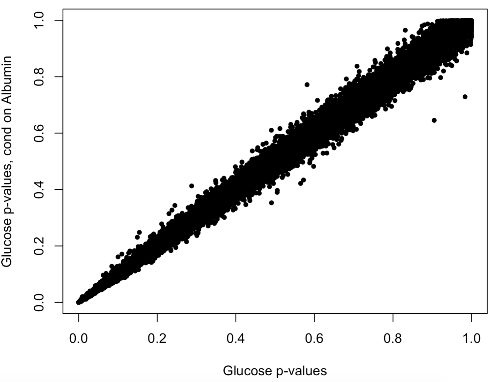

# cGAUGE: Causal Graphical Analysis Using GEnetics

cGAUGE is a set of tools that utilize conditional independence (CI) tests for improving causal inference among traits using genetic variables. 

There are three types of analyses that can be performed:
1. <em>ImpIV</em>: Filter out improper genetic instruments before Mendelian Randomization (MR) analysis between two traits. 
1. <em>UniqueIV</em>: Obtain a set of proper genetic instruments for MR. However, this is limited to trait pairs that have restricted (conditional) dependence.
1. <em>ExSep</em>: Search for evidence for the exitence of a causal pathway between two traits.

The analyses above require three preprocessing steps that can be done using external tools like PLINK or R. For notation let **T** be the set of traits and **G** be the set of genetic variants (after LD clumping or pruning).
1. <em>GWAS</em>: Obtain genome-wide association results for each genetic variable in **G** vs. every trait in **T**.
1. <em>Trait skeleton</em>: Compute a "skeleton" among the traits without using the genetic data. Skeletons are undirected graphs in which edges represent traits that cannot be rendered independent by conditioning on other traits.
1. <em>CI tests</em>: For each significant variant obtained in the GWAS step at a significance level p<sub>1</sub> for a trait tr<sub>1</sub>, test if it is no longer significant with p>p<sub>2</sub> when conditioning on another trait tr<sub>2</sub>. Keep the results for every triplet (g in **G**, tr<sub>1</sub>, tr<sub>2</sub>).

We provide several tools for computing the preprocessing steps above, but any custom scripts or tools can be used. Moreover, summary statistics from these steps can be used as well as input for cGAUGE. If such results are available, or you wish to use the UK-Biobank results that we provide below, then you can skip the next section. 

## Preprocessing tools

#### GWAS and CI tests

For GWAS and CI tests on large-scale genetic data we use PLINK2. Assume we have the following files: (1) pheno.phe: a phenotype file with a row per subject and three columns: family id (FID), individual id (IID), and the phenotype scores, which can be binary or continuous, (2) covars.phe: covariates file with a row per subject, the first two columns are FID and IID, and additional columns with covariates that we need to adjust for: sex, age, Array, and genetic principal components, and (3) a bed file with the individual-level genetic data. We then use the following command for logistic regression:
```
plink2 --bfile bed --logistic hide-covar firth-fallback \ 
  --pheno pheno.phe --covar covars.phe \
  --covar-name sex,age,Array,PC1,PC2,PC3,PC4,PC5 \
  --chr 1-22 --maf 0.01 
  --out ${output_path_name}
```
For linear regression we use `--linear hide-covar`. When running CI tests of analysis *3* above, make sure to add the name of tr<sub>2</sub> as a covarite. That is, use: `--covar-name sex,age,Array,PC1,PC2,PC3,PC4,PC5,tr_2_name`

For more information and source code on the analysis of the UKB biomarker data see this repository: https://github.com/rivas-lab/biomarkers

For analysis of without plink (e.g., for smaller datasets) we provide a few useful functions in [R/auxil_functions.R](R/auxil_functions.R) including: `run_lm(x,y,z,df)` which computes the effect size, standard error, and p-value for x~y|z - i.e., the linear effect of y on x when conditioned on z when all variables are available in the data frame df (rows are individuals). A more complex wrapper is called `run_ci_test_one_is_numeric(x,y,z,df)` that assumes that either x or y are numeric (or both) and internally decides how to use correlation analysis or linear regression to compute the p-value for x,y|z. Finally, `run_ci_logistic_test(x,y,z,df)` can be used to get the logistic p-value when x is a binary variable. For discrete data we also provide `run_discrete_ci_test(x,y,z,df,test)` where test is the test name (e.g., Pearson's Chi-square test), see the documentation for details. This is a wrapper of the [bnlearn](https://cran.r-project.org/web/packages/bnlearn/bnlearn.pdf) `ci.test` function that takes the same input as our functions above and returns a p-value. The functions that return p-values can be used in the next section as well (i.e., in addition for testing genetic instruments).

#### Skeletons

Skeletons can be computed using the [pcalg](https://cran.r-project.org/web/packages/pcalg/index.html) R package. Specifically, the `skeleton` function can be used to get the skeleton of all variables in a data frame. If you use this function make sure to use `m.max=2` to avoid an exponential running time by testing all possible sets (that are conditioned upon). Moreover, for speedups you can use the functions above as input e.g., `indepTest=run_lm` to use linear regression instead of discrete tests. Note that you can also increase `numCores` to run the tests in parallel. However, this is limited to the number of cores in the machine. To better utilize resources in an HPC, we provide a useful R script [hpc_stanford/analyze_trait_pair_for_skeleton.R](hpc_stanford/analyze_trait_pair_for_skeleton.R) that receives as input: (1) an RData file with a data frame that has all sample-level data, (2) the name of tr<sub>1</sub>, (3) the name of tr<sub>2</sub>, and (4) the maximal set cardinallity (equivalent to `m.max` above). Thus, this script can be used to get the CI result for a single trait pair, and thus can be run in parallel for many or all pairs. 

## cGAUGE: Input

For individual level data over a set of traits and a set of genetic variants you can follow the preprocessing steps above to obtain all summary statistics that cGAUGE requires. We provide below these results for 96 traits and their genetics results from the UK-Biobank. Note that the trait names in these datasets use the [Rivaslab GBE](https://biobankengine.stanford.edu/) codes, to map them to meaningful names use [this file](https://drive.google.com/file/d/1TveaMn38xAu-r7KKq4v2NtMl5u5LwWuI/view?usp=sharing).

1. An object with the p-values of all conditional independence tests for each variant g in **G** vs. a trait x in **T**. We represent this object using a named list of lists in which element [[tr1]][[tr2]] is a matrix with the conditional independence results (p-values) for trait 1 conditioned on trait 2 (rows are variants). The results for the UK-Biobank data are available [here](https://drive.google.com/file/d/1XNZSYlDnepnPdLgG5qBrtTHrlo2Yq7IG/view?usp=sharing). Here is an example code for using the provided results:
```
# useful objects in this:
# code2gwas_res - a list with the GWAS results, limited to p < 1e-04
# code2clumped_list - a list with the LD clump results per trait
# cl_unified_list - the union of the LD clump sets (can be further pruned)
# snp_P_matrix: a matrix of p-values (row per variant, column per trait)
# sum_stat_matrix: a matrix of effect sizes (row per variant, column per trait)
# sum_stat_se_matrix: a matrix of effect size standard error (row per variant, column per trait)
# OPTIONAL
# code2pruned_list - a list with the LD prune results per trait
# pr_unified_list - the union of the LD prune sets (can be further pruned)
load("single_gwas_res.RData")
> snp_P_matrix[1:3,1:3]
                statins Alanine_aminotransferase   Albumin
rs761193    3.63141e-05                 0.895412 0.5172800
rs116112655 2.16605e-05                 0.241373 0.7728420
rs115045185 4.19488e-05                 0.455153 0.0189549
> sum_stat_matrix[1:3,1:3]
              statins Alanine_aminotransferase     Albumin
rs761193    0.9188275               -0.0132903  0.01290840
rs116112655 1.0116227                0.1315650 -0.00641066
rs115045185 1.0493625               -0.0928334 -0.05761930
```

2. The skeleton analysis results [here](https://drive.google.com/file/d/1CGav4eGQLi-G1zCdqyrSXbGL8b_aseGM/view?usp=sharing). This link provides: (1) a square **|T|** X **|T|** matrix with the maximal p-value for each pair (tr<sub>1</sub>, tr<sub>2</sub>). That is, the maximal p-value obtained for the association of the pair (tr<sub>1</sub>, tr<sub>2</sub>) when trying to condition on another trait from **T**. and (2) a list of lists where each entry contains a matrix with the conditional association analysis results. Here is an example R code for loading this matrix and obtaining a skeleton graph:
```
# This skeleton was computed using p=1e-07 as a threshold for the separating sets below.
> load("Gs_skeleton.RData")
> pmax_network[1:3,1:3]
                              statins Alanine_aminotransferase      Albumin
statins                            NA             1.074641e-33 2.132759e-05
Alanine_aminotransferase 1.074641e-33                       NA 6.701961e-01
Albumin                  2.132759e-05             6.701961e-01           NA
# Use p=1e-07 to get an undirected graph
> skel = pmax_network < 1e-07
# Number of edges in the binary network
> table(skel[lower.tri(skel)])
FALSE  TRUE 
 4082   670 
 
# Another important object for cGAUGE is to keep the traits that separate skeleton non-edges. This is loaded as well here:
> sepsets$statins$C_reactive_protein[1:3,1:2]
                                                            newm                  
v                            ""                             "0.000285278553186906"
age                          "age"                          "0.000297802300660709"
age,Alanine_aminotransferase "age,Alanine_aminotransferase" "0.883563868908451"
```

3. Numeric matrices with a row for each genetic variant and a column for each trait. For running both the cGAUGE filters and MR analysis you will need three matrices: (1) P-values, (2) effect sizes, and (3) effect size standard error. These are available for the UK-Biobank data in a single RData file [here](https://drive.google.com/file/d/1XNZSYlDnepnPdLgG5qBrtTHrlo2Yq7IG/view?usp=sharing).

```
load("genetic_CI_tests_results.RData")
tr1 = "Glucose"
tr2 = "Albumin"
tr1_given_tr2 = trait_pair_pvals[[tr1]][[tr2]]
# take the last column - contains the tests with adjustment for covariats
tr1_given_tr2_p = tr1_given_tr2[,ncol(tr1_given_tr2)]
# for comparison, take the p-values of tr1 without conditioning on tr2
tr1_ps = snp_P_matrix[,tr1]
shared_snps = intersect(names(tr1_ps),names(tr1_given_tr2_p))
plot(tr1_ps[shared_snps],tr1_given_tr2_p[shared_snps],pch=20,
     xlab = "Glucose p-values",ylab = "Glucose p-values, cond on Albumin")
```
The resulting figure shows that there are only mild effects on the GWAS p-values of tr1 (Glucose) when conditioning on tr2 (Albumin):



4. (Optional) Additional useful files/data can be the [minor allele frequencies](https://drive.google.com/file/d/1uieq63XKxuCAKGRxaknm1bVWNvUiGLAY/view?usp=sharing) and the [positions of the variants](https://drive.google.com/file/d/1I9WqATOQ2SjEQDNSlvXvTi9wbXyZyTZl/view?usp=sharing).

## cGAUGE: Analysis and output

### Real data (UK-Biobank)

Assuming all data objects above are now available in the R session, you can now extract cGAUGE's results and run downstream MR analyses.

Here is the code to load all the downloaded dataset and processing it to get the input objects:

```
# Load the cGAUGE functions (assuming cGAUGE is in ~/repos)
source("~/repos/cGAUGE/R/cGAUGE.R")
# Load the internal optimization functions required for the ExSep test
source("~/repos/cGAUGE/R/twogroups_em_tests.R")

conditional_indep_tests = "genetic_CI_tests_results.RData"
skeleton_file = "Gs_skeleton.RData"
maf_file = "genotypes.frq"
bim_file = "genotypes.bim"
gwas_res_data = "single_gwas_res.RData"

# define the output path
out_path = "./res/"
# Load the data
load(conditional_indep_tests)
load(gwas_res_data)
load(skeleton_file)

# Use the clumped/prune variant lists (per trait)
pruned_snp_list = cl_unified_list
pruned_snp_lists = code2clumped_list
# Define the MAF for the downstream analysis
MAF = 0.01
# Read the MAF and location info
mafs = read.table(maf_file,stringsAsFactors = F,header=T)
bim = read.table(bim_file,stringsAsFactors = F)
mhc_snps = bim[bim[,1]==6 & bim[,4]>23000000 & bim[,4]<35000000,2]
our_snps = mafs$SNP[mafs$MAF >= MAF]
pruned_snp_list = intersect(pruned_snp_list,our_snps)
pruned_snp_list = intersect(pruned_snp_list,rownames(snp_P_matrix))
pruned_snp_list = setdiff(pruned_snp_list,mhc_snps)
for(nn in names(pruned_snp_lists)){
  pruned_snp_lists[[nn]] = intersect(pruned_snp_lists[[nn]],pruned_snp_list)
}
GWAS_Ps = snp_P_matrix[pruned_snp_list,]

# Define p1 and p2
p1 = 1e-07
p2 = 0.001
```

We can now get the (trait-based) minimal separating sets required for ImpIV:
```
p1_seps = get_minimal_separating_sets(sepsets,p1=1e-07)
G_t = pmax_network < p1
diag(G_t) = F;mode(G_t)="numeric"
```

We use the results above and the CI analyses to filter instruments:
```
# extract the second skeleton - "test2" and "test3" are the column names to use
# from each matrix in the trait_pair_pvals list (of lists)
G_vt = extract_skeleton_G_VT(GWAS_Ps,trait_pair_pvals,P1=p1,
                 P2=p2,test_columns = c("test2","test3"))[[1]]
ivs = cGAUGE_instrument_filters(G_t,G_vt,p1_seps,GWAS_Ps,p1,code2clumped_list)
uniqueivs = ivs$UniqueIV
impivs = ivs$ImpIV
# The unique iv instruments are also available in the Supplementary Data and fit
# the results here:
> uniqueivs$Alanine_aminotransferase[[1]]
 [1] "rs7587"      "rs112574791" "rs11607757"  "rs78569621"  "rs76015644"  "rs11607052"  "rs66716313"  "rs4148397"  
 [9] "rs12806"     "rs12339210"  "rs364585"    "rs6006598"   "rs4683709"   "rs117527803" "rs8043119"   "rs3842"     
[17] "rs4753530"   "rs118045039" "rs16920014"  "rs963441"    "rs62305723"  "rs37059"     "rs12747505"  "rs45467802" 
[25] "rs13045364"  "rs2928619"   "rs116860632" "rs56098714" 
```

We can use our instruments for MR and for pi_1 estimates:
```
meta_anal_uniqueiv_res = run_pairwise_pval_combination_analysis_from_iv_sets(uniqueivs,GWAS_Ps)
ivw_uniqueiv_res = run_pairwise_mr_analyses_with_iv_sets(
      sum_stat_matrix,sum_stat_se_matrix,uniqueivs,func=mr_ivw,robust=T,
      minIVs=3)

# We use lfdr to compute pi_1, but also provide the convest estimator results
> meta_anal_uniqueiv_res[1:3,]
     tr1->                      tr2                    lfdr_pi_1           convest_pi_1        numIVs
[1,] "Alanine_aminotransferase" "statins"              "0.103478058128079" "0"                 "28"  
[2,] "Alanine_aminotransferase" "Albumin"              "0.418377782237448" "0.428571428571428" "28"  
[3,] "Alanine_aminotransferase" "Alkaline_phosphatase" "0.436134621855124" "0.375"             "28" 

> ivw_uniqueiv_res[1:3,]
                  Exposure              Outcome            p        p_het        est         Q NumIVs
1 Alanine_aminotransferase              statins 0.2906155860 5.059940e-01 0.08672321  26.22767     28
2 Alanine_aminotransferase              Albumin 0.0003775984 2.768241e-05 0.02002564  67.22194     28
3 Alanine_aminotransferase Alkaline_phosphatase 0.5664689442 1.972091e-13 0.04612148 118.49506     28
```

We use the CI and GWAS results for the ExSep test:
```
# Make sure that there are no NAs in the input:
NonNA_GWAS_Ps = GWAS_Ps
NonNA_GWAS_Ps[is.na(NonNA_GWAS_Ps)] = 0.5
for(n1 in names(trait_pair_pvals)){
  for(n2 in names(trait_pair_pvals[[n1]])){
    m = trait_pair_pvals[[n1]][[n2]]
    m = m[rownames(GWAS_Ps),]
    m[is.na(m)] = 0.5
    trait_pair_pvals[[n1]][[n2]] = m
  }
  gc()
}

# Run the test for every edge in G_t (this is slow)
exsep_results1 = ExSepTests(NonNA_GWAS_Ps,G_t,trait_pair_pvals,text_col_name="test3")
# You can also run the test on a subset of the traits by taking specific columns from the 
# p-value matrix:
exsep_results2 = ExSepTests(NonNA_GWAS_Ps[,1:3],G_t,trait_pair_pvals,text_col_name="test3")
# You can also run the test among all pairs by specifying G_t to be all T
tmp_G_t = G_t
tmp_G_t[,] = T
exsep_results3 = ExSepTests(NonNA_GWAS_Ps[,1:3],tmp_G_t,trait_pair_pvals,text_col_name="test3")

> exsep_results2[1,]
   trait1                   trait2 pval:trait1->trait2
1 statins Alanine_aminotransferase                   1
```

### Running simulations

The main script for simulating data and obtaining the results for different methods including MR-Egger, IVW, and MR-PRESSO are available using the script [R/full_causal_graph_simulations.R](R/full_causal_graph_simulations.R):

```
$ Rscript R/full_causal_graph_simulations.R --help
Usage: R/full_causal_graph_simulations.R [options]


Options:
	--N=N
		Sample size for simulated data

	--p=P
		Number of phenotypes

	--deg=DEG
		Expected in/out degree in the causal graph, greater values mean more cycles

	--minBeta=MINBETA
		Min absolue value for causal effects (beta coefficients)

	--maxBeta=MAXBETA
		Max absolue value for causal effects (beta coefficients)

	--minIVs=MINIVS
		Min number of instruments per trait

	--maxIVs=MAXIVS
		Max number of instruments per trait

	--minPleio=MINPLEIO
		When applying pleiotropy, this is the min number of IV-trait links to add (at random)

	--maxPleio=MAXPLEIO
		When applying pleiotropy, this is the max number of IV-trait links to add (at random)

	--probPleio=PROBPLEIO
		Probability that a variant is pleiotropic

	--minMAF=MINMAF
		Minimal MAF - these are sampled with U(minMAF,maxMAF)

	--maxMAF=MAXMAF
		Maximal MAF - these are sampled with U(minMAF,maxMAF)

	--p1=P1
		P-value threshold for dependence - i.e., if p<p1

	--p2=P2
		P-value threshold for independence - i.e., if p>p2

	--out=OUT
		Output RData file with the simulated data and the analysis results

	--edgeSepRun=EDGESEPRUN
		0: run edgeSep with the other methods; 1: run edge sep only, ignore p2

	--cgaugeMode=CGAUGEMODE
		0: ImpIV - remove provably improper instruments (but may be imperfect); 1: UniqueIV - take the potentially small set of provably true instruments

	-h, --help
		Show this help message and exit
```

Note that this script assumes that the following packages are installed locally: 

### Additional comments

cGAUGE was developed and tested in R 3.4.0 and R 3.5.1

The scripts require the following packages: MendelianRandomization (v 0.4.1 or later), limma (v 3.38.0 or later), and MRPRESSO (v 1.0).

## Contact info

For suggestions please contact us at davidama AT stanford dot edu


